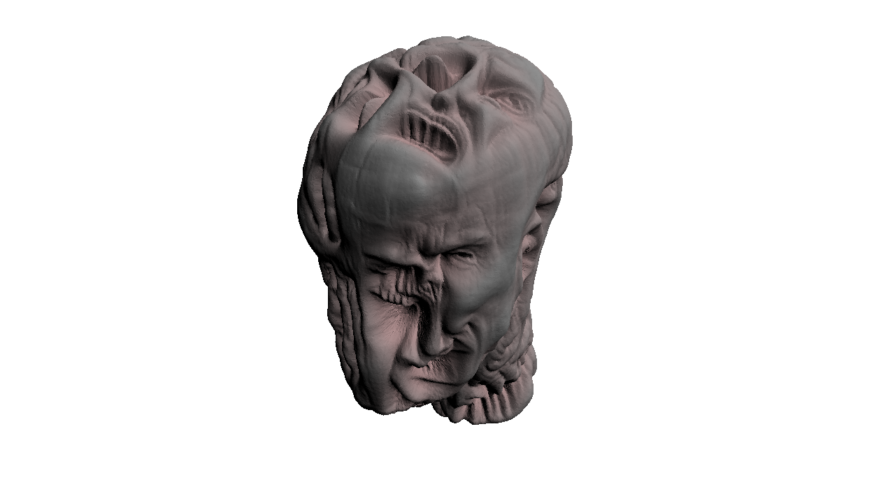

## 3D sculptures generated by learning normals guided by CLIP embeddings from text and image prompts.

Code adapted from https://threedle.github.io/text2mesh/ to generate strongly modified meshes.

Example head generated with prompt '3D sculpture of an evil head':

